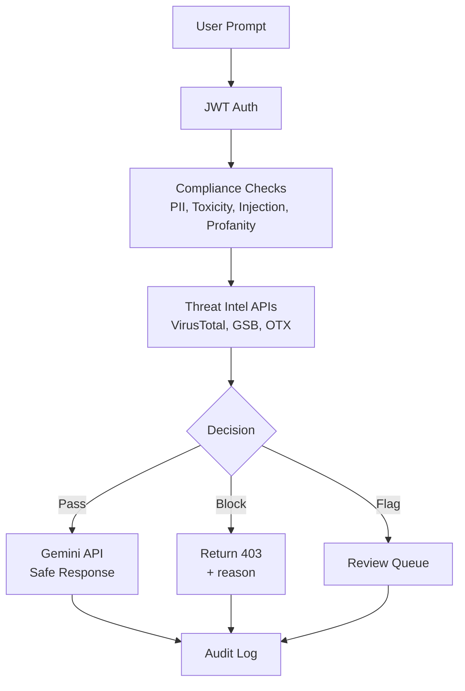

# Llm Prompt Security Middleware

  


## 📌 Overview

Middleware for LLM Security, Prompt Sanitization, and Data Privacy Compliance.  Detects and redacts PII, sensitive data, prompt injection, profanity, toxicity,  policy violations, and unsafe user input before it reaches an LLM.

## 🏗️ Architecture

```text
Browser / UI
     │   HTTP
     ▼
FastAPI, WebSockets (Flask-SocketIO) app (handlers: analysis_router, auth_router, dashboard_router, health_router, logs_router)
     │
     ├──▶ Services — alerts_service, gemini_service, google_safebrowsing_service, pii_service, profanity_service, prompt_injection_detector, …
     ├──▶ Database — PostgreSQL
     └──▶ External services — Google Gemini, VirusTotal, AbuseIPDB, email service, Google APIs, Google Safe Browsing · ML models — scikit-learn
```

## 🧰 Tech Stack

- **Language:** Python
- **Backend:** FastAPI, WebSockets (Flask-SocketIO)
- **Database:** PostgreSQL
- **ML:** scikit-learn
- **Integrations:** Google Gemini, VirusTotal, AbuseIPDB, email service, Google APIs, Google Safe Browsing
- **Deployment:** Docker container

## 🚀 Getting Started

### Prerequisites

- Python 3.10+
- Docker (optional, for container runs)

### 1. Clone

```bash
git clone https://github.com/SabarishR08/llm-prompt-security-middleware.git
cd llm-prompt-security-middleware
```

### 2. Install dependencies

```bash
python -m venv .venv
source .venv/bin/activate   # Windows: .venv\Scripts\activate
pip install -r requirements.txt
```

### 3. Configure environment

```bash
cp .env.example .env   # then fill in values
```

Environment variables used: `ENVIRONMENT`, `SECRET_KEY`, `JWT_SECRET_KEY`, `HOST`, `PORT`, `WORKERS`, `CORS_ORIGINS`, `RATE_LIMIT_ENABLED`, `RATE_LIMIT_REQUESTS`, `RATE_LIMIT_WINDOW`, `DATABASE_URL`, `DATABASE_POOL_SIZE`, `DATABASE_MAX_OVERFLOW`, `REDIS_URL`, `CACHE_TTL`, `LOG_LEVEL`, `LOG_FILE`, `SENTRY_DSN`, `ENABLE_METRICS`, `MAX_PROMPT_LENGTH`, `MAX_PROMPT_TOKENS`, `MAX_PAYLOAD_SIZE`, `GEMINI_API_KEY`, `VIRUSTOTAL_API_KEY`, `GOOGLE_SAFEBROWSING_API_KEY`, `ABUSEIPDB_API_KEY`, `ALERT_LEVEL`, `SMTP_HOST`, `SMTP_PORT`, `SMTP_USERNAME`, `SMTP_PASSWORD`, `SMTP_FROM_EMAIL`, `SMTP_TO_EMAIL`, `SENDGRID_API_KEY`, `SENDGRID_FROM_EMAIL`, `SENDGRID_TO_EMAIL`, `TWILIO_ACCOUNT_SID`, `TWILIO_AUTH_TOKEN`, `TWILIO_FROM_NUMBER`, `TWILIO_TO_NUMBER`.

External services involved: Google Gemini, VirusTotal, AbuseIPDB, email service, Google APIs, Google Safe Browsing.

### 4. Run

```bash
python app.py
```

```bash
python main.py
```

### (Alternative) Run with Docker

```bash
docker compose up --build
```


---

**AI Safety Gateway for Large Language Model Prompts**


A security middleware for LLM applications that analyzes prompts for **PII**, **toxicity**, **prompt injection**, and other threats before reaching AI models.

---

## 🎯 What It Does

This middleware sits between users and LLMs, scanning every prompt for:

- **PII (Personally Identifiable Information)** - Names, emails, phone numbers, SSNs, credit cards
- **Toxic Content** - Hate speech, threats, insults, obscenity
- **Prompt Injection** - SQL injection, command injection, jailbreak attempts
- **Profanity & Blocked Keywords** - Configurable word lists
- **Malicious URLs** - Via VirusTotal, Google Safe Browsing, OTX

Only safe, compliant prompts reach the LLM. Everything is logged for audit trails.

---

##  Core Features

| Feature | Description | Status |
|---------|-------------|--------|
|  **PII Detection** | Presidio-based NER for sensitive data |  Active |
|  **Toxicity Scoring** | Detoxify ML model (0.0-1.0 scores) |  Active |
|  **Injection Prevention** | Regex + heuristics for attacks |  Active |
|  **Threat Intelligence** | VirusTotal, GSB, OTX integration |  Active |
|  **RBAC** | Admin, Moderator, User roles (JWT) |  Active |
|  **Audit Logging** | SQLite DB with full request tracking |  Active |
|  **LLM Integration** | Google Gemini API with safety filters |  Active |

---

## 🚀 Quick Start

### Prerequisites
- Python 3.10+
- pip

### Installation

```bash
# Clone repository
git clone https://github.com/SabarishR08/llm-prompt-security-middleware.git
cd llm-prompt-security-middleware

# Create virtual environment
python -m venv venv
source venv/bin/activate  # Windows: venv\Scripts\activate

# Install dependencies
pip install -r requirements.txt

# Download ML models
python -m spacy download en_core_web_sm

# Configure environment
cp .env.example .env
# Edit .env with your API keys

# Initialize database
python -c "from core.models.database import DatabaseManager; DatabaseManager('logs.db').init_db()"
```

### Run

```bash
uvicorn main:app --reload --host 0.0.0.0 --port 8000
```

Access at:
- 🏠 **Web UI**: http://localhost:8000
- 📚 **API Docs**: http://localhost:8000/docs

---

## 📊 How It Works



> **More diagrams**: See [docs/ARCHITECTURE.md](docs/ARCHITECTURE.md)

---

## 🔌 API Examples

### Analyze a Prompt

```bash
curl -X POST http://localhost:8000/api/analysis/analyze \
  -H "Authorization: Bearer YOUR_JWT_TOKEN" \
  -H "Content-Type: application/json" \
  -d '{
    "prompt": "What is the weather in Paris today?"
  }'
```

**Response:**
```json
{
  "status": "PASS",
  "prompt": "What is the weather in Paris today?",
  "pii_detected": false,
  "toxicity_score": 0.02,
  "injection_detected": false,
  "gemini_response": "The current weather in Paris is...",
  "analysis_id": "uuid-here"
}
```

### Get Audit Logs (Admin/Moderator only)

```bash
curl http://localhost:8000/api/logs \
  -H "Authorization: Bearer ADMIN_TOKEN"
```

---

## 📂 Project Structure

```
llm-prompt-security-middleware/
│
├── main.py                    # FastAPI app entry point
├── requirements.txt           # Python dependencies
├── .env.example              # Environment template
│
├── api/                      # API routes
│   └── routes/
│       ├── analysis_router.py  # Main analysis endpoint
│       ├── auth_router.py      # Authentication
│       ├── logs_router.py      # Audit logs
│       └── health_router.py    # Health checks
│
├── core/                     # Core logic
│   ├── services/             # Business logic
│   │   ├── pii_service.py         # PII detection
│   │   ├── toxicity_service.py    # Toxicity scoring
│   │   ├── prompt_injection_detector.py
│   │   ├── gemini_service.py      # LLM integration
│   │   └── threat_intel_service.py
│   │
│   ├── models/               # Database models
│   │   └── database.py
│   │
│   └── middleware/           # HTTP middleware
│       ├── rate_limit.py
│       └── security_headers.py
│
├── tests/                    # Unit tests
│   └── test_security_features.py
│
├── docs/                     # Documentation
│   ├── ARCHITECTURE.md
│   └── DEPLOYMENT_GUIDE.md
│
└── frontend/                 # Web UI
    └── templates/
```

---

## 🔒 Security Features

### Authentication & Authorization
- JWT-based authentication (HS256, 24-hour expiration)
- Role-based access control (Admin, Moderator, User)
- Bcrypt password hashing (12 rounds)

### Request Protection
- Rate limiting (100 req/min per IP)
- Security headers (HSTS, CSP, X-Frame-Options)
- Input validation (Pydantic schemas)
- Request ID tracking (distributed tracing)

### Data Protection
- Audit logging (immutable SQLite records)
- PII redaction in logs
- Encrypted API keys storage

---

## 📈 Performance (Local Testing)

| Metric | Observation |
|------|-------------|
| Average Latency | ~40–60ms (local testing) |
| Throughput | Suitable for concurrent requests |
| Test Coverage | All security tests passing |


---

## 🐳 Docker Deployment

```bash
# Build image
docker build -t llm-security-middleware .

# Run container
docker run -p 8000:8000 --env-file .env llm-security-middleware

# Using docker-compose
docker-compose up -d
```

---

## 🔧 Configuration

Key environment variables in `.env`:

```bash
# API Keys
GEMINI_API_KEY=your_key_here
VIRUSTOTAL_API_KEY=your_key_here
GOOGLE_SAFEBROWSING_API_KEY=your_key_here

# Security Thresholds
PII_THRESHOLD=0.5
TOXICITY_THRESHOLD=0.7
INJECTION_THRESHOLD=0.6

# JWT Secret
JWT_SECRET_KEY=your-secret-key-min-32-chars
```

---

## 📚 Documentation

| Document | Purpose |
|----------|---------|
| [ARCHITECTURE.md](docs/ARCHITECTURE.md) | System design & data flow |
| [DEPLOYMENT_GUIDE.md](docs/DEPLOYMENT_GUIDE.md) | Production deployment |
| [QUICK_START.md](docs/QUICK_START.md) | Getting started guide |

---

## 🧪 Testing

```bash
# Run all tests
pytest tests/ -v

# Run with coverage
pytest tests/ --cov=. --cov-report=html

# Run specific test
pytest tests/test_security_features.py::TestPromptInjectionDetector -v
```

---

## 🤝 Contributing

1. Fork the repository
2. Create feature branch: `git checkout -b feature/amazing-feature`
3. Commit changes: `git commit -m 'Add amazing feature'`
4. Push to branch: `git push origin feature/amazing-feature`
5. Open Pull Request

---

## 📄 License

MIT License - See [LICENSE](LICENSE) file

---

## 💬 Contact & Support

**Sabarish R**
- 📧 Email: sabarish.edu2024@gmail.com
- 💼 LinkedIn: [linkedin.com/in/sabarishr08](https://www.linkedin.com/in/sabarishr08)

**Issues**: [GitHub Issues](https://github.com/SabarishR08/llm-prompt-security-middleware/issues)

---

*Last Updated: December 2025*

---

## 📄 License

[MIT](LICENSE) — © 2026 Sabarish R.
