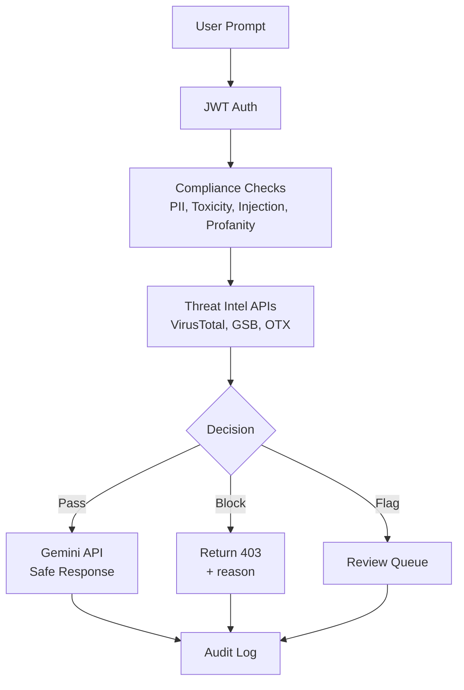
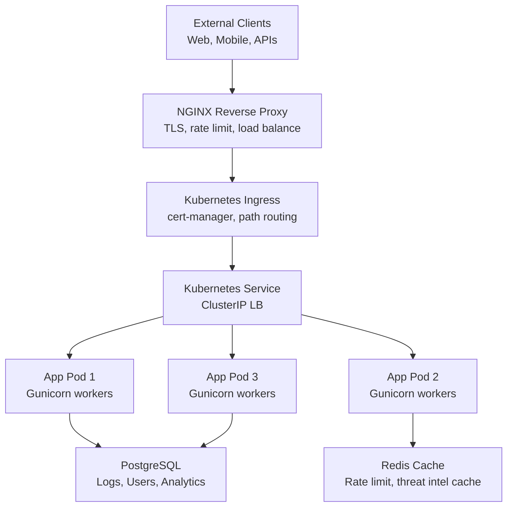
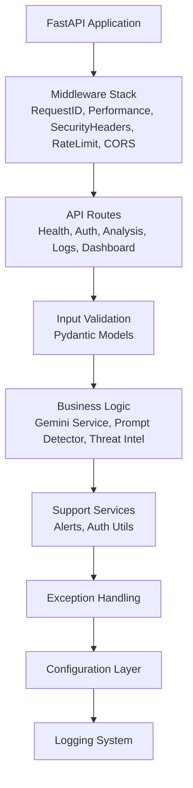
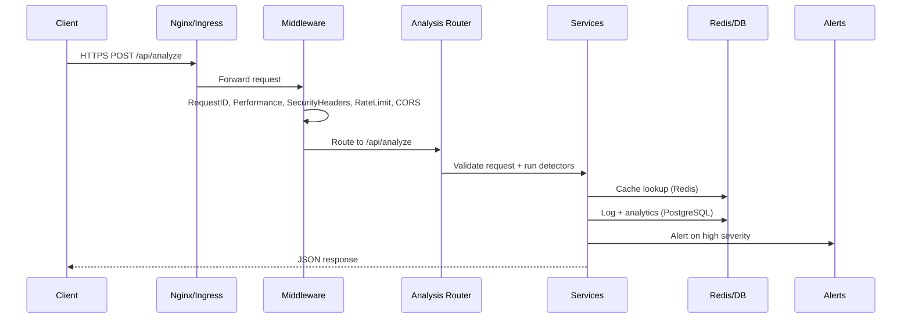
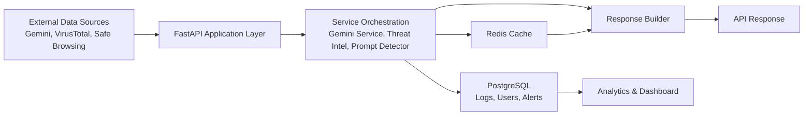
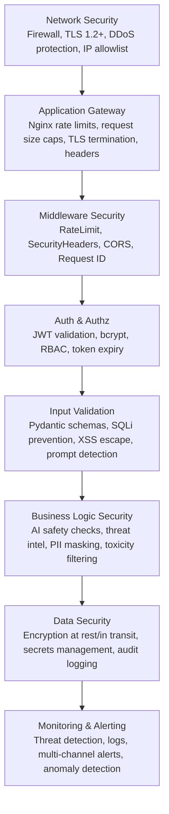
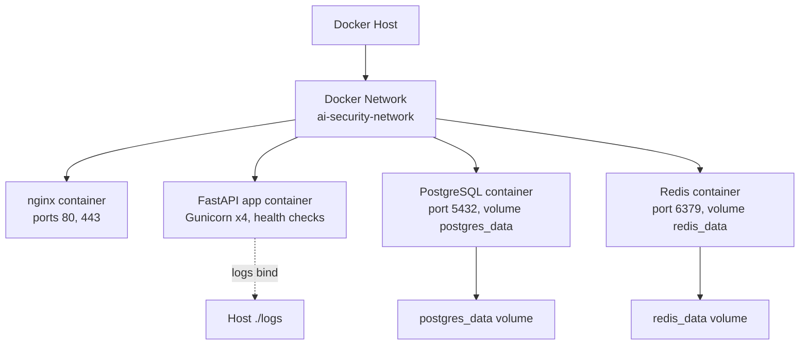
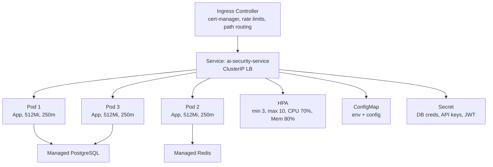

# 🏗️ System Architecture

## High-Level Architecture

---

## Application Layer Architecture

---

## Request Flow Diagram

---

## Data Flow

---

## Security Layers

---

## Deployment Architecture

### Docker Compose (Development/Small Production)

### Kubernetes (Enterprise Production)

---

## Technology Stack Summary

**Backend:**
- FastAPI 0.115.0 (Modern async web framework)
- Gunicorn 23.0.0 (WSGI server)
- Uvicorn 0.32.1 (ASGI server)
- Pydantic 2.10.3 (Data validation)

**Database:**
- PostgreSQL 15+ (Relational database)
- SQLAlchemy 2.0.36 (ORM)
- Alembic 1.14.0 (Migrations)

**Caching:**
- Redis 7+ (In-memory cache)
- hiredis 3.0.0 (Performance optimization)

**Security:**
- PyJWT 2.10.1 (Token management)
- bcrypt 5.0.0 (Password hashing)
- python-jose 3.3.0 (Cryptography)

**AI & NLP:**
- Google Generative AI 0.8.3 (Gemini API)
- tiktoken 0.8.0 (Token counting)

**Monitoring:**
- psutil 6.1.0 (System metrics)
- python-json-logger 3.2.1 (Structured logging)
- Sentry SDK 2.19.2 (Error tracking)

**Infrastructure:**
- Docker (Containerization)
- Kubernetes (Orchestration)
- Nginx (Reverse proxy)

**CI/CD:**
- GitHub Actions (Automation)
- Trivy (Vulnerability scanning)
- Bandit (Security analysis)

---

**Architecture Version:** 2.0.0  
**Last Updated:** 2024  
**Designed For:** Enterprise Production Deployment
