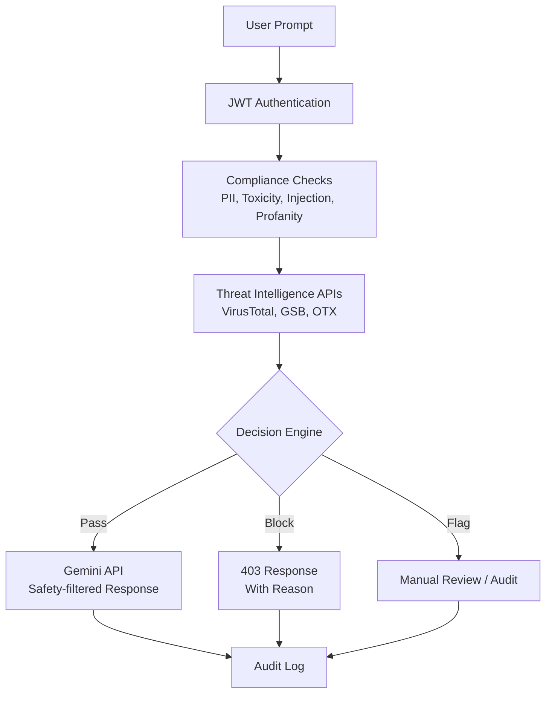
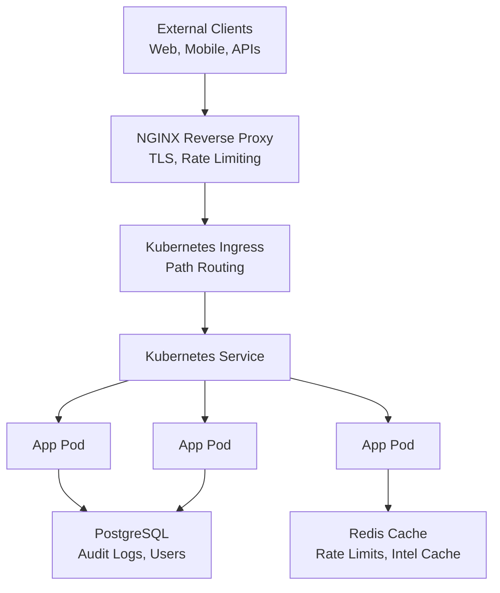
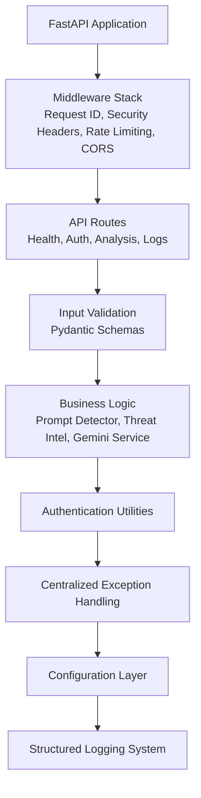
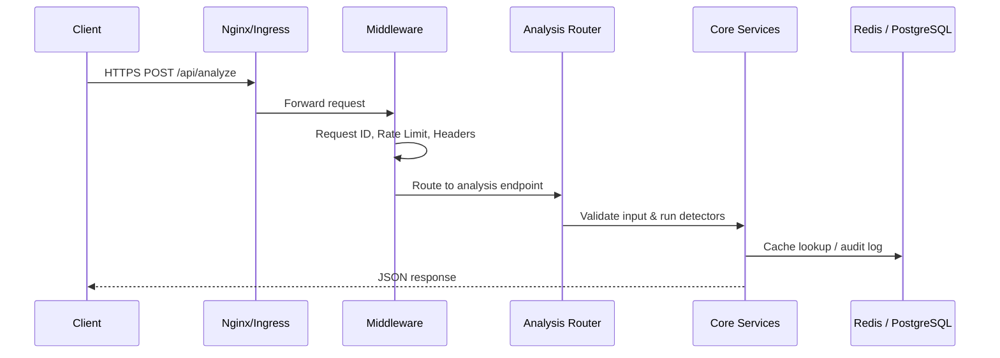
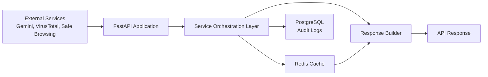
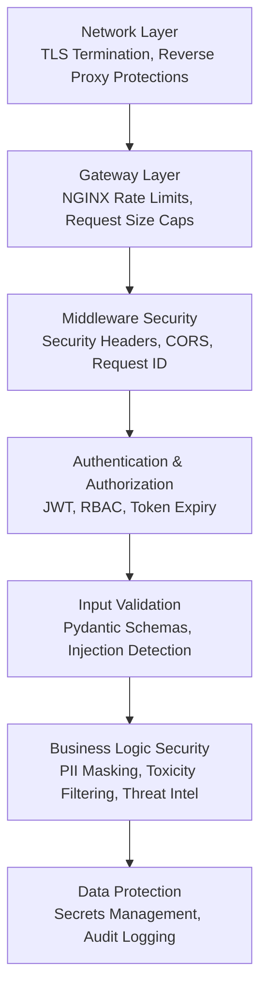
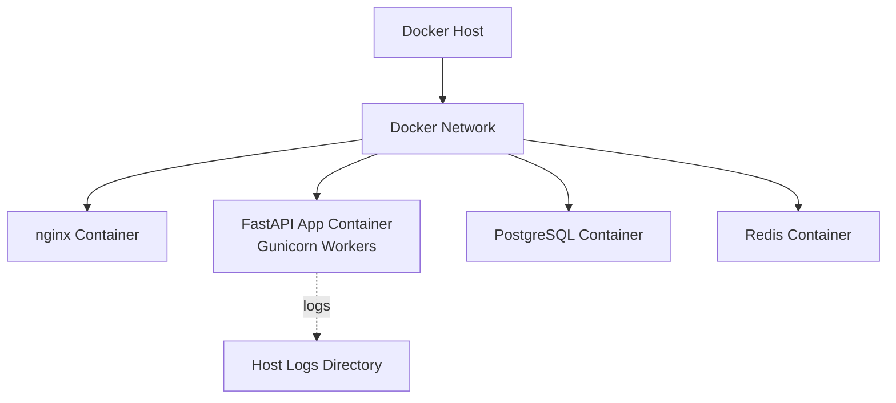
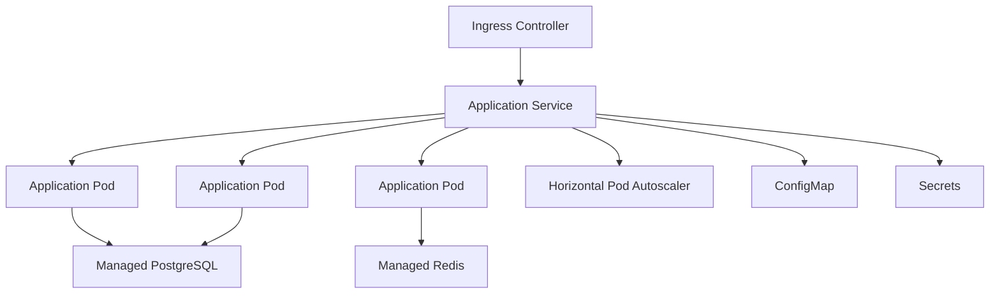

# 🏗️ System Architecture

This document describes the **design, data flow, and security architecture** of the **LLM Prompt Security Middleware**. The architecture is designed with a **defense-in-depth** approach and reflects the **actual implementation and reference deployment patterns** used in this project.

---

## High-Level Architecture

---

## Application Layer Architecture

---

## Request Flow Diagram

---

## Data Flow

---

## Security Layers (Defense in Depth)

---

## Deployment Architecture

### Docker Compose (Development / Small-Scale Deployment)

### Kubernetes (Scalable Production Reference)

> **Note:** Kubernetes deployment is provided as a **reference architecture** demonstrating scalability and security best practices.

---

## Technology Stack Summary

### Backend

* FastAPI (Async API framework)
* Gunicorn + Uvicorn (ASGI/WSGI servers)
* Pydantic (Request & response validation)

### Database & Storage

* PostgreSQL (Audit logs, user data)
* SQLAlchemy (ORM)
* Alembic (Schema migrations)

### Caching

* Redis (Rate limiting, threat intel caching)

### Security

* JWT (Authentication & RBAC)
* bcrypt (Password hashing)
* python-jose / PyJWT (Token cryptography)

### AI & NLP

* Google Gemini API (LLM integration)
* Token counting & prompt analysis utilities

### Observability

* Structured JSON logging
* Error tracking (Sentry-compatible)

### Infrastructure

* Docker (Containerization)
* Kubernetes (Orchestration – reference)
* NGINX (Reverse proxy)

### CI/CD & Security Tooling

* GitHub Actions (CI/CD automation)
* Bandit (Static security analysis)
* Trivy (Container & dependency scanning)

---

